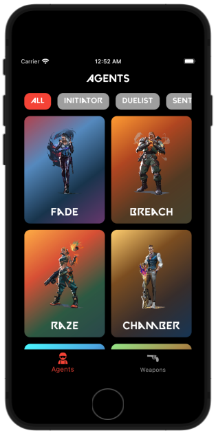
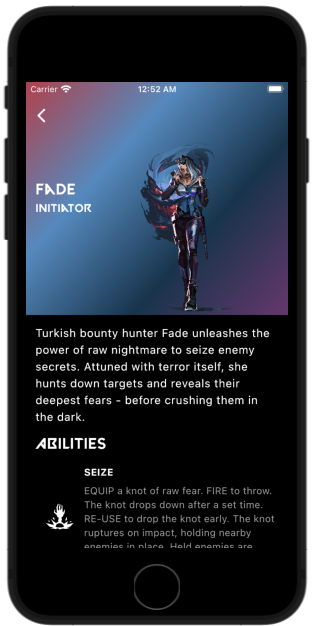
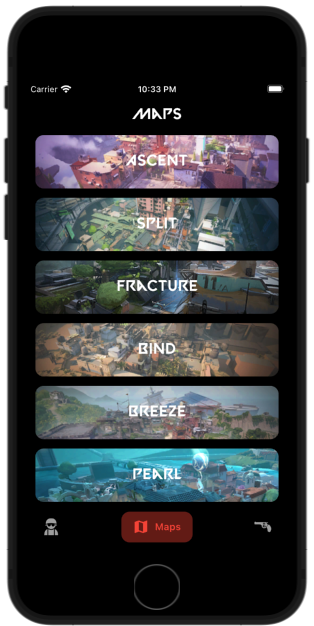
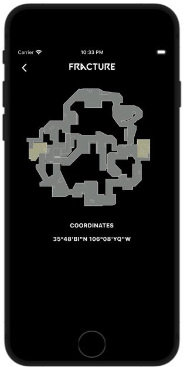
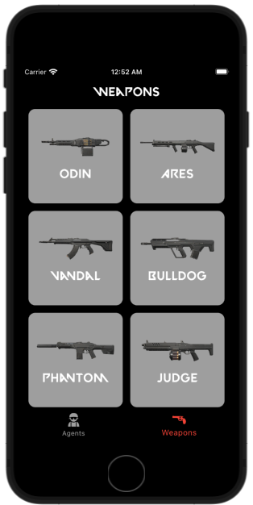
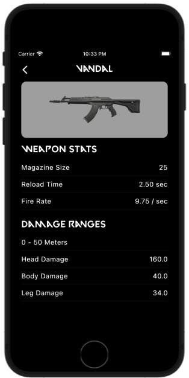

# Valorant Universe Clean Architecture

Provides information about agents, maps and weapons in the game VALORANT. Built with Clean Architecture, Flutter Bloc and Valorant-Api.

## Preview

<table>
  <tr>
    <td>Splash</td>
    <td>Agents</td>
    <td>Agent Detail</td>
    <td>Maps</td>
  </tr>
  <tr>
     <td></td>
     <td></td>
     <td></td>
     <td></td>
  </tr>
  <tr>
    <td>Map Detail</td>
    <td>Weapons</td>
    <td>Weapon Detail</td>
  </tr>
  <tr>
     <td></td>
     <td></td>
     <td></td>
  </tr>
</table>

## Built With

- [Flutter](https://flutter.dev/)
- [Dart](https://dart.dev/)
- [Valorant-Api](https://valorant-api.com/)

## Packages

- State Management
  - [Bloc](https://pub.dev/packages/flutter_bloc)
- Dart Data Class Generation
  - [Freezed](https://pub.dev/packages/freezed)
  - [JsonSerializable](https://pub.dev/packages/json_serializable)
- Functional Programming
  - [Dartz](https://pub.dev/packages/dartz)
- Network
  - [Dio](https://pub.dev/packages/dio)
  - [DioSmartRetry](https://pub.dev/packages/dio_smart_retry)
  - [PrettyDioLogger](https://pub.dev/packages/pretty_dio_logger)
  - [InternetConnectionChecker](https://pub.dev/packages/internet_connection_checker)
- Navigation
  - [AutoRoute](https://pub.dev/packages/auto_route)
- Localization
  - [EasyLocalization](https://pub.dev/packages/easy_localization)
- Dependency Injection
  - [GetIt](https://pub.dev/packages/get_it)
- UI
  - [Lottie](https://pub.dev/packages/lottie)
  - [SalomonBottomBar](https://pub.dev/packages/salomon_bottom_bar)
  - [CachedNetworkImage](https://pub.dev/packages/cached_network_image)
- Testing
  - [Mocktail](https://pub.dev/packages/mocktail)
  - [BlocTest](https://pub.dev/packages/bloc_test)

### Run this project

##### Clone this repository

```sh
git clone https://github.com/cem256/valorant_universe_clean_arch
```

##### Go to the project directory

```sh
cd valorant_universe_clean_arch
```

##### Get all the packages

```sh
flutter pub get
```

##### Open the project folder and execute these scripts in the terminal

```sh
sh scripts/build_runner.sh
sh scripts/localization.sh
```

##### Run the project
